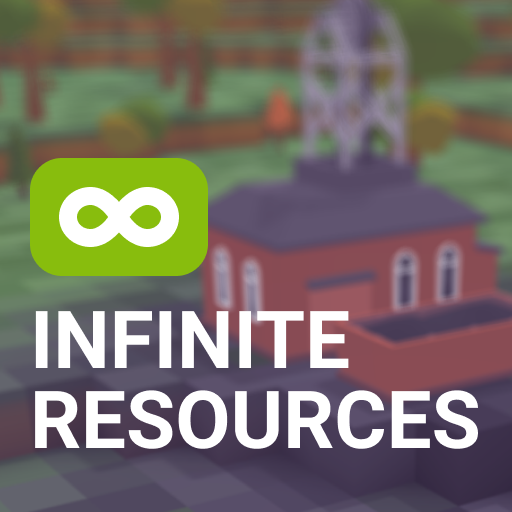
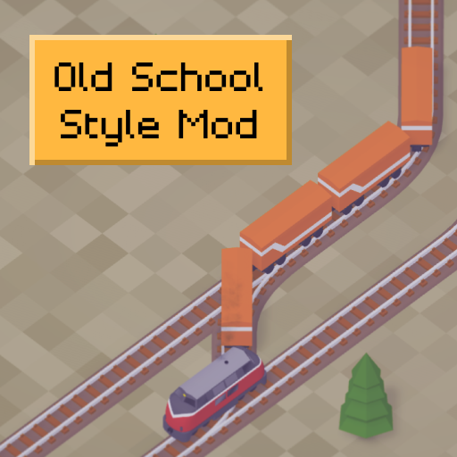

# Voxel Tycoon Mods and Samples

This is a repository containing source code for mods and samples made by Voxel Tycoon Devs.

Modding documentation: [**docs.voxeltycoon.xyz**](https://docs.voxeltycoon.xyz)

> `VoxelTycoon.dll` and `UnityEngine.CoreModule.dll` are not included in the repository. Their actual location is automatically detected using the `Directory.Build.props` file if VoxelTycoon is installed in the default SteamLibrary location. If VoxelTycoon is installed at a different location, place a `VoxelTycoonInstallationDirectory.txt` in the repository directory and write the path to directory containing the `VoxelTycoon.exe` executable. E.g. `C:\Program Files (x86)\Steam\steamapps\common\VoxelTycoon`

## Hello Voxel World

Source code for [**Creating your first script mod**](http://docs.voxeltycoon.xyz/guides/script-mods/creating-your-first-script-mod/) guide, with added example of creating custom notification action.

## Settings Example

Shows how to implement custom settings for your mod, so the player can tune them before starting a new game.

## Infinite Resources

Makes resource deposits never deplete.

## Old School Style

Make the game older by 20 years thanks to nostalgic old school styled vehicles movement.

Use F3 for extra immersion.
